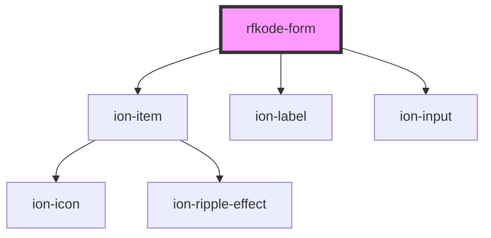

# rfkode-form

<!-- Auto Generated Below -->

## Properties

| Property | Attribute | Description | Type     | Default     |
| -------- | --------- | ----------- | -------- | ----------- |
| `data`   | --        |             | `Object` | `undefined` |
| `schema` | --        |             | `Schema` | `undefined` |

## Dependencies

### Depends on

- ion-item
- ion-label
- ion-input

### Graph

----------------------------------------------

*Built with [StencilJS](https://stenciljs.com/)*
